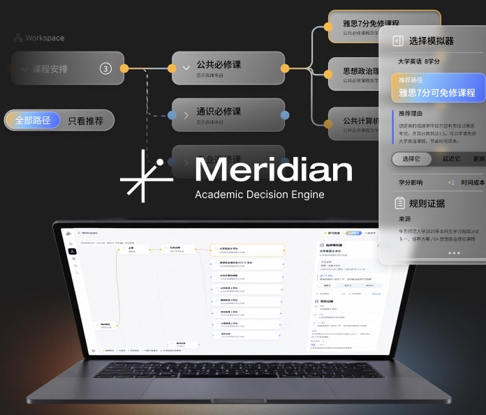

# Meridian

**Academic Decision Engine · 让学业规划有依据，让每次选择看得见。**

Meridian 是一个面向高校学生的学业规划与决策辅助工具。它将分散的培养要求、学校规则与个人进度组织成可探索的路径画布，结合选择模拟和 AI 解释，帮助用户理解：还有哪些要求需要完成、不同选择会带来什么变化，以及建议依据来自哪里。



*产品宣传视觉，由项目维护者提供；具体可用功能取决于部署配置与学校数据。*

[快速开始](docs/GETTING_STARTED.md) · [设计与实现](docs/PRODUCT_DESIGN.md) · [数据与隐私](PRIVACY.md) · [贡献指南](CONTRIBUTING.md) · [许可证](LICENSE)

## 为什么是 Meridian

学业规划的难点，往往不只是缺少建议，而是规则、目标和个人进度彼此分离。学生需要在手册、培养方案与课程信息之间反复查找，才能判断某个选择是否适用。

Meridian 把这件事组织为一个连续的工作流：**整理背景 → 查看要求 → 比较选择 → 理解依据 → 跟踪进度**。目标是让用户在学校规则内做出更清楚的安排，把更多时间留给科研、实践与个人兴趣。

## 核心能力

| 能力 | 用户可以做什么 | 实现边界 |
| --- | --- | --- |
| 路径工作区 | 按要求展开课程、毕业环节与关联规则，切换全部路径和推荐视图 | 基于已配置的学校与培养方案数据 |
| 选择模拟 | 预览某个选项完成后的学分与要求进度变化 | 局部状态模拟，不是全局最优化或完整 GPA 预测 |
| AI 学业顾问 | 结合目标、路径结构及已解析文档获得流式解释和建议 | 默认 mock；真实回答需要登录与服务端模型配置 |
| 规则依据 | 查看规则说明、来源引用，并在配置检索库后补充手册上下文 | 检索失败或无匹配时可能不附加检索内容 |
| 文档与进度 | 管理个人资料、课程进度和上传资料，提取可读文本作为上下文 | 文字 PDF 与文本类文档可解析；不含 OCR 或 Word 解析 |
| 数据管理 | 通过 Supabase 管理账号、个人数据、文件与会话 | 依赖部署端数据库、存储及权限策略 |

## 一次典型使用

1. **建立背景**：填写学校、入学年份、专业和目标，补充课程及完成进度。
2. **理解路径**：在 Workspace 中展开关心的要求，查看可选事项与规则关联。
3. **比较影响**：打开选择模拟器，观察选项对学分和当前要求的影响。
4. **追问依据**：使用 AI 顾问理解推荐理由，结合规则来源核对适用条件。
5. **持续更新**：维护已完成事项，让后续建议建立在更新后的进度上。

## 设计与工程亮点

### 规则先建立结构，AI 再补充解释

推荐流程先根据结构化要求、目标和完成状态生成启发式路径，再尝试通过 AI 补充理由。模型返回经 Zod 校验；请求或解析失败时保留已有路径。当前实现不会让模型任意改写路径节点集合。

### 在修改记录之前预览影响

选择模拟器使用独立的计算函数构造假设进度，不直接写入数据库。用户可以先理解局部变化，再决定如何安排。规则事实、个人记录与模拟状态在职责上分开，便于解释结果。

### 将依据带入对话

浏览器提取个人文档文本，服务端可对问题生成向量并调用手册检索 RPC，将命中片段加入模型上下文。引用与原始规则帮助用户核对建议，不能替代人工判断或学校正式审核。

### 清晰的前后端边界

前端通过统一 provider 调用 `/api/ai/chat`。服务端完成会话验证、实例内频率限制和上游调用；用户数据访问使用 Supabase 与数据库行级权限策略。上游模型密钥不应进入浏览器配置。

更多交互决策和代码入口见 [设计与实现](docs/PRODUCT_DESIGN.md)。

## 技术栈

| 层次 | 主要技术 |
| --- | --- |
| 应用 | React 19、TypeScript、TanStack Start / Router、Vite |
| 界面 | Tailwind CSS 4、Radix / shadcn/ui、Lucide、GSAP |
| 数据 | Supabase Auth、Postgres、Storage、RLS、pgvector |
| AI | mock / remote provider、SSE 流式协议、Zod、智谱 GLM 服务端代理 |
| 部署 | Cloudflare Workers |

## 本地开始

```bash
git clone https://github.com/Betonme519/Meridian-.git
cd Meridian-
npm ci
npm run dev
```

使用符合 Vite 7 要求的 Node.js（20.19+ 或 22.12+）及 npm。也可以使用项目已有的 Bun 工作流。

不配置后端时可检查界面与 mock 对话，但账号、上传、数据库记录和真实 AI 不可完整使用。完整配置、数据库初始化与排查说明见 [快速开始](docs/GETTING_STARTED.md)。

## 当前范围

- 当前学校规则与样例数据主要围绕华东师范大学，不能直接视为覆盖所有高校或所有年级。
- 默认 AI provider 是 mock。真实模型、手册向量库与个人数据都依赖部署者配置。
- 部分 Dashboard 决策卡为静态内容，不应解读为自动生成的个人风险结论。
- 选择模拟覆盖当前要求与分类的进度变化，不传播完整先修依赖，也不提供缺少成绩条件下的 GPA 预测。
- 项目不承诺成绩、录取或毕业结果；学校当期正式规定及审核结论优先。
- 本仓库未提供统一的 `test` 脚本或已验证的模型准确率、用户规模、性能基准，不将规划目标作为现有成果宣传。

## 参与与许可

欢迎提交可复现的问题、学校规则适配建议和聚焦的功能改进。请先阅读 [贡献指南](CONTRIBUTING.md)，安全问题参见 [安全说明](SECURITY.md)。

本项目原创软件代码采用 [MIT 许可证](LICENSE)。第三方依赖、学校文件、课程手册和品牌宣传素材不因此自动获得同一授权，范围见 [第三方资料与许可说明](THIRD_PARTY_NOTICES.md)。
